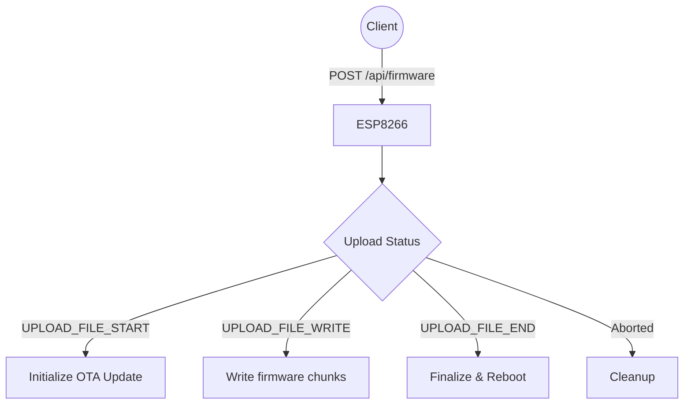

# OTA Class

Class OTA handles both firmware updates and file management on LittleFS. 
It provides API endpoints for OTA updates, file operations, and directory management.

## Integration with HTTPServerManager

Below is an example how to integrate the OTA class into a project. The project must 
include instance of HTTPServerManager. 

```c++
#include "HTTPServerManager.h"
#include "OTA.h"

// Initialize HTTPServerManager
HTTPServerManager httpServerManager;

// Initialize OTA 
OTA ota(httpServerManager); 

void setup() {
    // Initialize LittleFS
    LittleFS.begin();

    // Register OTA endpoints
    ota.begin();     

    // Start the server
    httpServerManager.begin();
}

void loop() {
    httpServerManager.loop();
}
```

## Key Features
1. **Firmware Update**: OTA firmware upload via /api/firmware.
2. **File Management**: Upload/download/delete files and create directories through API endpoints.
3. **File System Stats**: Retrieve storage usage and recursive directory listings.


## API Usage

All endpoints are registered via `HTTPServerManager::registerPage()` with the following pattern:
```cpp
_serverManager.registerPage(path, method, handler, upload_handler);
```
---
### 1. Firmware Update
**Endpoint**: `/api/firmware`  
**Method**: `POST`  
**Handler**: `handleFirmwareUpload`  
**Parameters**: Multipart/form-data file upload  
**Flow**:


**Behavior**:
- Uses async OTA updates with `Update.runAsync(true)`
- Auto-calculates required space: `(ESP.getFreeSketchSpace() - 0x1000) & 0xFFFFF000`
- Progress reporting through hooks:
  - `reportStep(1)`: Start
  - `reportStep(2)`: Write progress
  - `reportStep(-3)`: Failure

**Responses**:
- `200 OK`: Firmware updated successfully
- `500 Internal Error`: Update failure with error details
- Auto-reboots on success after 500ms delay

**Example**:
```bash
curl -X POST -F "file=@firmware.bin" http://device-ip/api/firmware
```

---

### 2. File Upload
**Endpoint**: `/api/upload`  
**Method**: `POST`  
**Handler**: `handleFileUpload`  
**Parameters**:
- `directory` (form field): Target directory (default: "/")
- File content (multipart upload)

**Behavior**:
- Maintains file handle across upload chunks
- Auto-creates directories if path doesn't exist
- Overwrites existing files silently
- Progress reporting through hooks:
  - `reportStep(1)`: Start
  - `reportStep(2)`: Write progress
  - `reportStep(-3)`: Failure

**Responses**:
- `200 OK`: File uploaded successfully
- `500 Internal Error`: Update failure with error details

**Example**:
```bash
curl -X POST -F "directory=/config" -F "file=@settings.json" http://device-ip/api/upload
```

---

### 3. System Reboot
**Endpoint**: `/api/reboot`  
**Method**: `GET`  
**Response**:
```json
{"status": 1}  // Device reboots in 500ms
```

**Behavior**:
- 500ms delay before `ESP.restart()` call
- Immediate response with `{"status": 1}` before reboot


---

### 4. Directory Listing
**Endpoint**: `/api/directories`  
**Method**: `GET`  
**Handler**: `handleDirectoryList`  
**Response**:
```json
["/", "/config", "/logs"]
```
**Behavior**:
- Only lists root directory entries:
  ```cpp
  Dir dir = LittleFS.openDir("/");  // Fixed root scan
  while (dir.next()) {
    response += "\"" + dir.fileName() + "\",";
  }
  ```
- Returns simple array: `["/file1", "/dir1", ...]`

---

### 5. File System Inspection
**Endpoint**: `/api/files`  
**Method**: `GET`  
**Handler**: `handleFileSystemRequest`  
**Response Structure**:
```json
{
  "total": 3145728,
  "used": 131072,
  "free": 3014656,
  "files": [
    {"name": "/config.txt", "type": "file", "size": 1024},
    {"name": "/logs/", "type": "directory", "size": 0}
  ]
}
```

**Behavior**:
- Returns **JSON Structure**:
```cpp
JsonDocument doc;
doc["total"] = fs_info.totalBytes;
doc["used"] = fs_info.usedBytes;
doc["free"] = fs_info.totalBytes - fs_info.usedBytes;
JsonArray files = doc["files"].to<JsonArray>();
```
- Recursive Listing:
```cpp
void listFilesRecursive(const String& dirPath, JsonArray& filesArray) {
  Dir dir = LittleFS.openDir(dirPath);
  while (dir.next()) {
    // Adds "name", "type", "size" fields
    if (dir.isDirectory()) listFilesRecursive(...); 
  }
}
```
---

### 6. File Download
**Endpoint**: `/api/download`  
**Method**: `GET`  
**Handler**: `handleDownloadRequest`  
**Parameter**: `file` (query string) 

**Streaming Mechanism**:
```cpp
File file = LittleFS.open(filePath, "r");
server.streamFile(file, "application/octet-stream");
```
- No size validation/range requests implemented
- Direct binary stream with MIME type `application/octet-stream`

---

**Example**:
```bash
curl -o local.txt http://device-ip/api/download?file=/config/settings.txt
```

---

### 7. File Deletion
**Endpoint**: `/api/delete`  
**Method**: `DELETE`  
**Handler**: `handleDeleteRequest`  
**Parameter**: `path` (query string) 

**Code Flow**:
```cpp
String path = server.arg("path");
if (LittleFS.exists(path)) {
  LittleFS.remove(path);  // No recursive deletion
}
```
- Only handles single file deletion
- No directory removal capability


**Example**:
```bash
curl -X DELETE http://device-ip/api/delete?path=/old_config.txt
```

---

### 8. Directory Creation
**Endpoint**: `/api/addDirectory`  
**Method**: `POST`  
**Handler**: `handleAddDirectoryRequest`  
**Request Format**:
```json
{
  "parentPath": "/config",
  "dirName": "backups"
}
```

**Code Flow**:
```cpp
String fullPath = parentPath + "/" + dirName;
LittleFS.mkdir(fullPath);  // No intermediate dir creation
```

**Example**:
```bash
curl -X POST -H "Content-Type: application/json" -d '{"parentPath":"/","dirName":"data"}' http://device-ip/api/addDirectory
```
---

### Security Considerations
1. No authentication mechanisms implemented
2. Full filesystem access exposed via API
3. No size limits on file uploads (risk of filesystem exhaustion)
4. No validation on `directory` parameter in file uploads
5. Static file handles in upload handlers (potential race conditions)
6. Reboot endpoint exposed as simple GET request
7. Recommended for internal networks only

### Error Reporting
All endpoints:
- Return HTTP 500 on failures
- Log errors via `Logger` when available
- Report OTA progress through `reportStep()` hooks (1=start, 2=progress, negative=errors)


## Server Registration Patterns
**Dual Handler Registration**:
```cpp
// For POST endpoints with file uploads
_serverManager.registerPage(
  "/api/firmware", 
  HTTP_POST,
  [this](ESP8266WebServer& srv) { handleFirmwareUpload(srv); },
  [this](ESP8266WebServer& srv) { handleFirmwareUpload(srv); }
);
```

**Hook System**:
Add progress hooks
```cpp
ota.addReportStepHook([](int step) {
  // Handle step value
});
```
For example if there are defined led handlers, i.e., objects of `LEDHandler`, then one can hook a `reportStep()` like so: 
```cpp
// Assign a lambda function to variable "reportStep"
auto reportStep = [&](int step){
  if(step==0) { normalLED.setMode(NONE); errorLED.setMode(NONE);}
  if(step==1 || step==3)       normalLED.on();
  else if(step==2 || step==4)  normalLED.off();
  else if(step<0) {
    if(step==-2)      errorLED.setMode(BLINK2TIMES);
    else if(step==-3) errorLED.setMode(BLINK3TIMES);
    else if(step==-4) errorLED.setMode(BLINKFAST);
    else errorLED.setMode(BLINKONCE);      
  }             
};
otaManager.addReportStepHook(reportStep);
```
